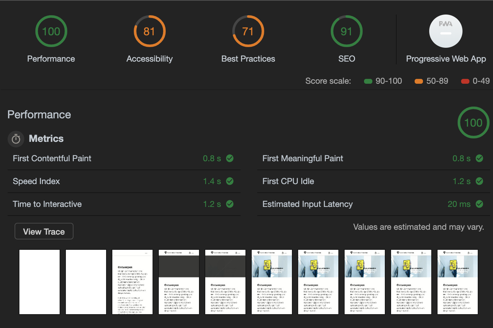
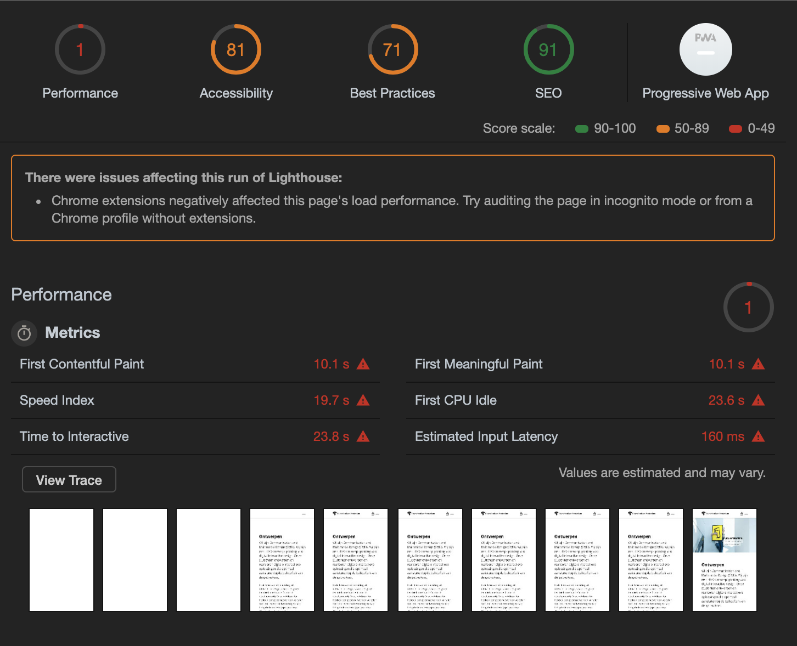
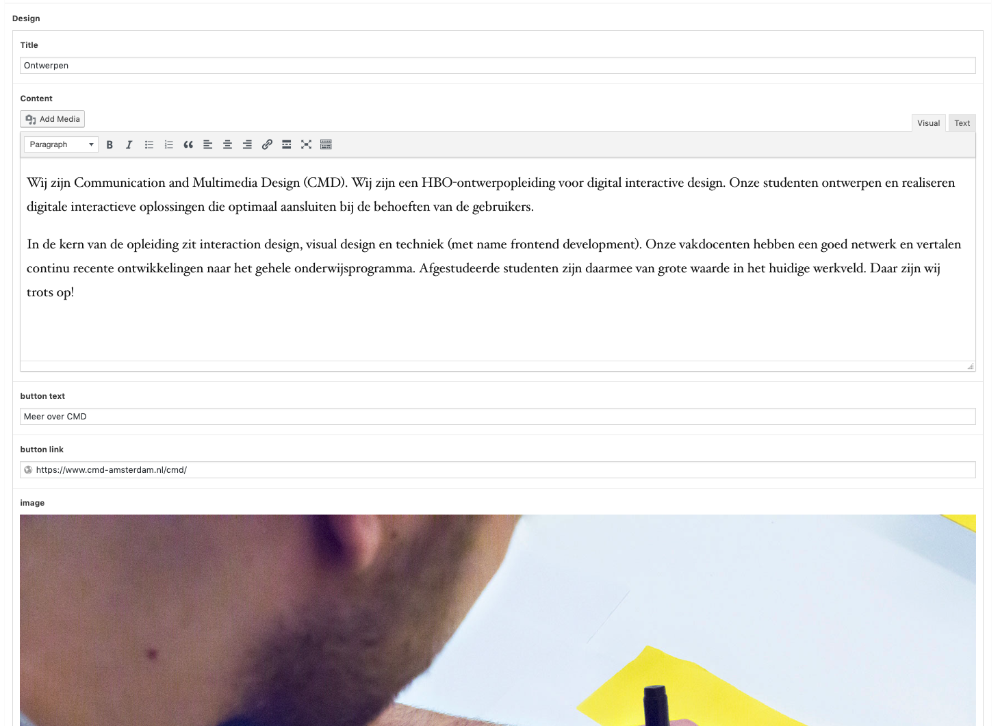
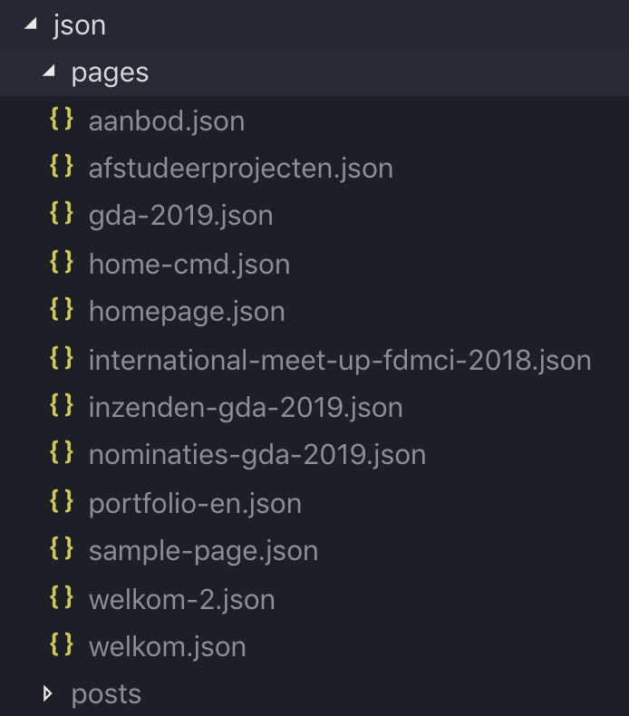
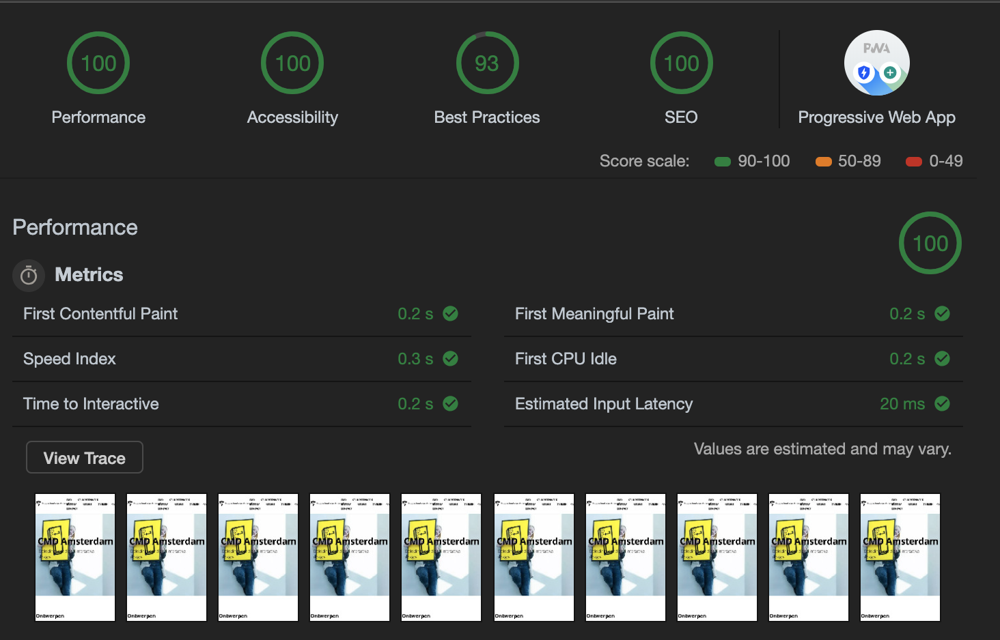
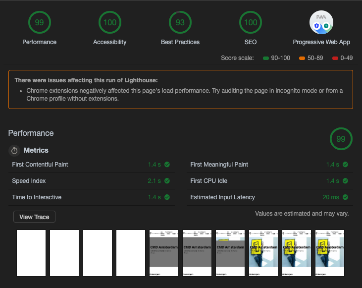

# Project 2 @cmda-minor-web · 2018-2019

During this project I recreated a page from the CMDA website and tried to find a more efficient way to display the pages and the overall workflow.


## Live version

The live version can be found at [https://cmda-project2.herokuapp.com/](https://cmda-project2.herokuapp.com/)

## Installation

```bash
git clone https://github.com/timruiterkamp/project-2-1819.git
cd performance-matters-1819
yarn or npm install
yarn start or npm start

visit site on http://localhost:3000

Enjoy!
```

## First impressions

The first thing I did was ran a audit on the website and find out what is wrong with it. I did two test, one with the current internet speed and one with a 3G network.

|         Current network          |      3G network       |
| :------------------------------: | :-------------------: |
|  |  |

As you can see there is some work to do, especially for the 3G network. Those speeds will make a visitor leave the page before seeing any information.

Other usability tests on the homepage:

- Disabling javascript deletes the complete introduction screen
- Disabling CSS will also delete the introduction
- Disabling image idem, the other content goes under eachother which is a good thing.
- There is no tab highlighting
- The current HTML setup has 65 validation errors and 49 warnings
- The css consists of 135 errors and 2159 warnings
- The web accesibility evaluation tool noticed 15 errors, 7 alerts, 2 contrast errors.
- H1 element is missing
- Forms do not have correct labels
- H tags seem to be empty or non existant sometimes
- Links don't have fallback text
- Complete rapport can be found at ['http://wave.webaim.org/report#/https%3A%2F%2Fwww.cmd-amsterdam.nl%2F']('http://wave.webaim.org/report#/https%3A%2F%2Fwww.cmd-amsterdam.nl%2F')

## Taking the helicopter (insert Joost emoji)

The first thing I noticed was that the client himself defined as a content manager and highlighted that he had not many experience with the web.

Based on this finding, I took a look at his current workflow. The current workflow consists despite filling content also out of designing elements. This gives him creative freedom, but I am not sure how happy he currently is with this.

So I found an alternative, same content management system (wordpress) but with Advanced Custom Fields. This contains of just text fields that he would need to fill in. Cons of this workflow is that he has little influence on the layout of the page.

Illustration of the use of ACF (advanced custom fields):  


As you can see above, there is little distraction and a stepwise way to fill content. I just created this as a dummy, but you can give information on the values the content manager needs to fill in.

Pros:

- Just fill in content
- No more bloated HTML and CSS elements
- It's fast and stays fast
- Easy to expand

cons:

- Elimantes creative freedom
- Need webdevelopers to create new templates.

## Some logic I wrote to improve speed

The current workflow makes a call at every page that is loaded. This requires a lot of data and that is just unnescessary. So for this reason I created a function that loops over every post, page or other endpoint and create json files with the data that the enpoints contain.

This should be an one time trigger that would ideally be connected to the publish function of wordpress. This way the files always stay on the server and there would be no need for any requests to other API's.

The functions for an endpoint look like this:

```javascript
createJsonPages: function() {
    return fetch(pageUrl)
      .then(data => data.json())
      .then(res => {
        res.map(page =>
          fs.writeFile(
            `./src/json/pages/${page.slug}.json`,
            JSON.stringify(page),
            "utf8",
            err => {
              if (err) return console.log(err);
              console.log(`${page.slug} was saved`);
            }
          )
        );
      });
  },
```

And this results in a folder structure with all the files in it. Showed below:


### What about images?

I fetch the images from the endpoint urls and store them locally in a assets map.
Over these images I run the following function:

```javascript
const downloadFiles = async function downloadAll(files) {
  const results = [];
  for (const file of files) {
    let result;
    try {
      result = await download(
        file.toString(),
        `./src/assets/${file.substring(file.lastIndexOf("/") + 1)}`,
        function(err, res) {
          if (err) {
            console.log(err);
          }
          webp.cwebp(
            `./src/assets/${file.substring(file.lastIndexOf("/") + 1)}`,
            `./src/assets/${file.substring(
              file.lastIndexOf("/") + 1,
              file.lastIndexOf(".")
            )}.webp`,
            "-q 80",
            function(status, error) {
              if (status === 100) {
                console.log(status);
              }
            }
          );
        }
      ); // wait for async operation to finish.
    } catch (error) {
      result = "failed:" + error.message;
    }
    results.push(result);
  }
  return results;
};
```

Which download all the given url's and converts them to webp formats.
After this is complete I have a gulp task which builds every image into different widths:

```javascript
gulp.task("imageTransformation", function(cb) {
  return gulp
    .src("src/assets/*.{jpg,png,webp}")
    .pipe(
      responsive({
        // Convert all images to WEBP format
        "*": [
          {
            // image-medium.webp is 375 pixels wide
            width: 375,
            rename: {
              suffix: "-medium",
              extname: ".webp"
            }
          },
          {
            // image-large.webp is 480 pixels wide
            width: 480,
            rename: {
              suffix: "-large",
              extname: ".webp"
            }
          },
          {
            // image-extralarge.webp is 768 pixels wide
            width: 768,
            rename: {
              suffix: "-extralarge",
              extname: ".webp"
            }
          }
        ]
      })
    )
    .pipe(gulp.dest("src/assets"))
    .pipe(gulp.dest("public/assets"));
});
```

This function creates multiple dimensions for every asset so that it can be loaded for the correct viewports by making use of srcset on the image tag.

### Service worker, manifest and compression

To optimize this app for on- and offline use, I created a service worker which makes the website offline available and besides that, caches the content of the page for even faster results. This combined with compression from the server makes it serve content way faster than it did before.

The manifest makes the website downloadable and install it on the users device.

### HTTP2

I included HTTP2 but after trying to deploy it for a hour, I read that heroku doesn't support HTTP2 and so I could not deploy it.. The source code is still in the server.js file but it is outcommented for deployment reasons.

## Conclusion

After changing the way content is being added, with bloated HTML and CSS, I hoped to prove the point that with just managing the websites content and leaving the base website setup unharmed, there can be a lot of usability and performance improvements.

To narrow it all down:
The results for the normal internet speed improved by 3-5 times.

|         Current CMD site         |          My Take          |
| :------------------------------: | :-----------------------: |
|  |  |

But at the 3G speeds I improved the site by around 10 times and almost got the same results as the site now gets at full internet speed.

|   Current CMD site    |             My Take             |
| :-------------------: | :-----------------------------: |
|  |  |

## To Do

- [ ] Add same static file support for subpages
- [ ] Add cronjobs
- [x] Integrate service workers
- [x] Deploy to heroku
- [x] HTTP2
- [x] Local files with extended image sizes
